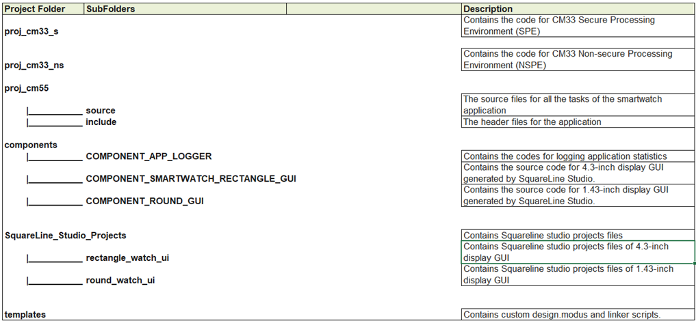
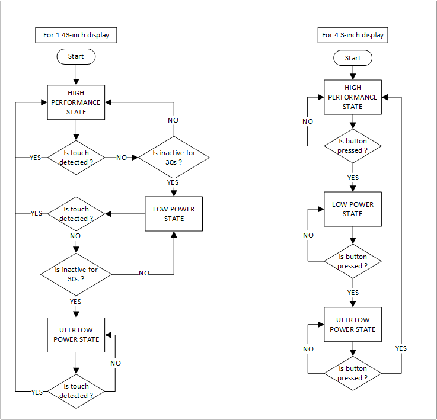
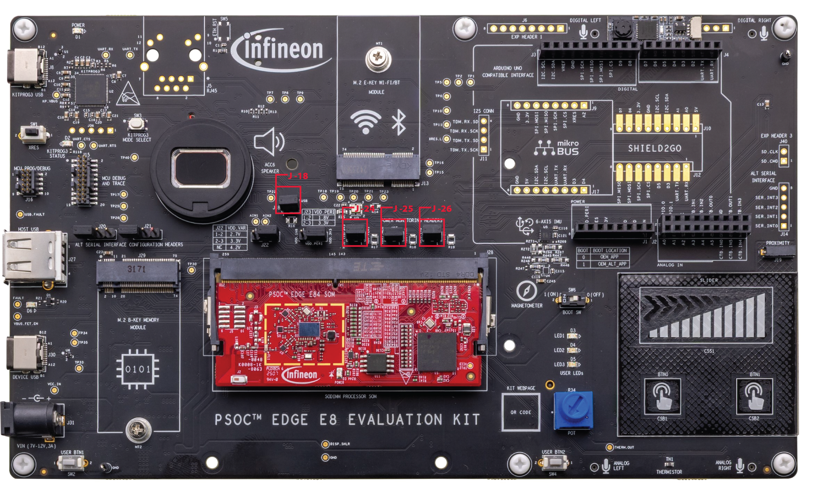

[Click here](../README.md) to view the README.

## Design and implementation

All PSOC&trade; Edge E84 MCU applications have a dual-CPU three-project structure to develop code for the CM33 and CM55 cores. The CM33 core has two separate projects for the secure processing environment (SPE) and non-secure processing environment (NSPE). A project folder consists of various subfolders – each denoting a specific aspect of the project.

The folder structure of this application is as follows:

   **Figure 1. Folder structure**

   

All three projects are programmed to the external QSPI flash and executed in XIP mode. In this code example, at device reset, the secure boot process starts from the ROM boot with the secure enclave (SE) as the root of trust (RoT). From the secure enclave, the boot flow is passed on to the system CPU subsystem where the secure CM33 application starts. After all necessary secure configurations, the flow is passed on to the non-secure CM33 application. Resource initialization for this example is performed by this CM33 non-secure project. It configures the system clocks, pins, clock to peripheral connections, and other platform resources. It then enables the CM55 core using the `Cy_SysEnableCM55()` function and subsequently put itself into Deep Sleep mode. Once CM55 is enabled it configures system clocks, pins, clock to peripheral connections, and other platform resources. To conserve power, the CM55 CPU employs Multi-counter Watchdog Timer (MCWDT) 1 as a Low Power Timer (LPTIMER). This integration allows the FreeRTOS to enter a tickless idle state, enabling the device to transition into Deep Sleep when the CPU is idle, minimizing power consumption. Here, the CM55 application implements the logic for this code example.

This code example is supported on two display setups: two variants of 1.43-inch circular display (driven by CO5300 controller) and the Waveshare 4.3-inch Raspberry-Pi DSI LCD. <br>
The 1.43-inch circular display is interfaced with MIPI DSI command mode protocol. Whereas, the Waveshare 4.3-inch display is interfaced with MIPI DSI Video mode protocol.

The Waveshare 4.3-inch display's touch panel interrupt line is not connected to the PSOC&trade; Edge Evaluation Kit because of which, the application changes the operating states based on the User Button 1 (USER BTN1) interrupt.

Because of the difference in the interface protocol and the display hardware capability, the source code also has certain differences which are noted further in this document. The project can be built for either of the displays using the following defines in the *common.mk* file:<br>

**For 4.3-inch display:**
```
CONFIG_DISPLAY=RECTANGLE_4_3_INCH
```

**For 1.43-inch display:**
```
CONFIG_DISPLAY=DASTEK_ROUND_1_43_INCH
```
or
```
CONFIG_DISPLAY=MICROTECH_ROUND_1_43_INCH
```

> **Note:** Captions such as **For 1.43-inch display** and **For 4.3-inch display** will be used to note the differences for the respective displays.

### Application structure
The smartwatch application code present under the CM55 project folder is FreeRTOS-based with the following tasks:

**Table 1. FreeRTOS tasks in the application**

FreeRTOS tasks | Description
--------|------------------------
Smartwatch App Task | This FreeRTOS task performs VGLite configuration, LVGL and UI initialization and regular updates to the screen/UI
App State Manager Task | The system power and clock settings are managed by this task based on the state of the application <br><br> ***For 1.43-inch display:*** This tasks changes the state of the application based on the 30 seconds of inactivity period <br> ***For 4.3-inch display:*** This tasks changes the state of the application based on button press of USER BUTTON 1 (USER BTN1) <br>
Step Count Task | This task handles step counting by incrementing the count and updating the UI through the ui_step_cb function
Time Date Task | This is a task for reading the Real-Time Clock every 1 sec and updating the time to respective RTOS queue

### Firmware flow

**For 4.3-inch display**

The "Smartwatch App Task" calls the refresh_screen() function every LV_DEF_REFR_PERIOD (set to 16 milliseconds) in synchronization with the 60 Hz display refresh rate in a thread-safe manner. The refresh_screen() function, in turn calls the lv_timer_handler() API to drive LVGL time-related tasks ensuring invalidated areas of the screen are checked and redrawn every LV_DEF_REFR_PERIOD.

**For 1.43-inch display**

Similar to the video mode display, the application calls the refresh_screen() function every SCREEN_REFRESH_TIME_MS (30 ms), which in turn uses lv_timer_handler() to invalidate and redraw the invalidated areas of the screen at every LV_DEF_REFR_PERIOD.

Three rendering modes are available, selected by the `USE_PARTIAL_BUFFER_MODE` and `USE_SINGLE_BUFFER_MODE` flags in *lv_port_disp.h*:

**Full-buffer rendering** (`USE_PARTIAL_BUFFER_MODE = 0`, default):
Double-buffer `LV_DISPLAY_RENDER_MODE_FULL` mode - two full-screen frame buffers. LVGL renders the next frame into one buffer while the display controller reads from the other. The `disp_flush()` callback sets the frame buffer address and kicks an interrupt-driven async DBI transfer via `Cy_GFXSS_Transfer_Frame_Async()`. A binary semaphore (`frame_tx_sem`) signals completion, enabling pipelined rendering with no tearing.

**Single-buffer rendering** (`USE_SINGLE_BUFFER_MODE = 0`, default):
A single-buffer variant of full-buffer rendering is available via the `USE_SINGLE_BUFFER_MODE` flag in *lv_port_disp.h* (applies only when `USE_PARTIAL_BUFFER_MODE = 0`). Setting it to `1` allocates only one full-screen frame buffer, reducing frame buffer RAM by ~50%. In single-buffer mode, the flush path always uses the blocking `Cy_GFXSS_Transfer_Frame()` so that LVGL cannot begin rendering the next frame until the DBI has finished reading the buffer. This trades a small amount of tearing on fast animations for a significant RAM saving.

**Partial-buffer rendering** (`USE_PARTIAL_BUFFER_MODE = 1`):
RT1170-style hybrid partial mode using `LV_DISPLAY_RENDER_MODE_PARTIAL` with VGLite GPU acceleration. LVGL renders into a small strip buffer (48 rows × 512 px × 2 B ≈ 48 KB), and `flush_cb` blits each strip into a persistent full-screen `shadow_fb` (512×466×2 = 477 KB). Note that in this mode, `disp_flush()` does *not* initiate a DBI transfer - it only copies the strip into `shadow_fb` and accumulates the dirty-row bounding box. At `LV_EVENT_REFR_READY`, the `disp_refr_ready_cb()` callback sets the frame buffer address and issues a single partial-window DBI transfer via `Cy_GFXSS_TransferPartialFrame_Async()` covering only the union of dirty rows - pipelined with the next LVGL refresh via the same semaphore/ISR mechanism as the full-buffer async path. Static screens transmit zero bytes; small UI updates (e.g., watch hands tick) transmit only the affected rows (~80 KB vs. 477 KB full buffer).

**Table 2. Frame buffer RAM usage by mode**

Mode | Flag | Buffers | Frame buffer RAM | Notes
-----|------|---------|-----------------|------
Double-buffer (default) | `USE_PARTIAL_BUFFER_MODE = 0` | 2 × 512×466×2 B | **953 KB** | No tearing; async DBI flush
Single-buffer | `USE_PARTIAL_BUFFER_MODE = 0`, `USE_SINGLE_BUFFER_MODE = 1` | 1 × 512×466×2 B | **477 KB (~50% saving)** | Always using blocking DBI flush to reduce possible minor tearing on fast animation
Partial-buffer | `USE_PARTIAL_BUFFER_MODE = 1` | shadow_fb + strip | **514 KB (~45% saving)** | Bandwidth scales with dirty area; async partial DBI transfer

> **Note:**
> - Partial-buffer rendering is available only for MIPI DSI command-mode displays (1.43-inch CO5300). The 4.3-inch video-mode display always uses double-buffer full-frame rendering.
> - The `USE_PARTIAL_BUFFER_MODE` and `USE_SINGLE_BUFFER_MODE` are mutually exclusive. `USE_PARTIAL_BUFFER_MODE` takes precedence: when it is set to `1`, the `USE_SINGLE_BUFFER_MODE` flag is ignored. Enable at most one of the two RAM-optimization options at a time.

The application operates in three states as described in **Table 3**.

**Table 3. Operating states of the application**

Application state | Description
--------|------------------------
High-performance state | - System Active power profile is set to high performance <br> - The CM55 operates at 400 MHz frequency <br> - The display shows high-performance UI with max possible refresh rate <br> - The graphics are rendered using GPU <br>
Low-power state | - GPU is turned off. The graphics are rendered with minimal CPU usage <br> **For 1.43-inch display:** <br>- The display shows "Always-ON" UI with 1/9 Hz refresh rate <br> - The System Active power profile is set to ultra-low power mode <br> - The CM55 operates at 50 MHz frequency and system goes to DeepSleep periodically when CPU is idle and no frame is getting rendered <br> **For 4.3-inch display:** <br>- The display shows "Always-ON" UI with 1 Hz refresh rate <br> - The System Active power profile is set to low-power mode <br> - The CM55 operates at 140 MHz frequency <br>
Ultra-low power state | - The display is turned off and the MCU enters into system Deep Sleep for maximum power conservation <br> **For 1.43-inch display:** - The application waits for touch activity for wake-up <br> **For 4.3-inch display:** - The application waits for button press of USER BUTTON 1 (USER BTN1)  <br>

   **Figure 2. State change diagram**

   

## Key performance indicator
Key performance indicator (KPI) data, including current consumption, CPU usage, and FPS, is being collected during various stages of application operation.

#### CPU current profile

The MCU power consumption is estimated by measuring the currents of the VBAT = 3.3 V, VDDD = 1.8 V,VDDUSB = 3.3 V and VDD/VDDIO = 1.8 V domain. The VBAT, VDDD, VDDUSB and VDD/VDDIO domain currents can be measured using the J25, J26, J18 and J24 jumpers, respectively on the PSOC&trade; Edge Evaluation Kit.

   **Figure 3. Current measurement pin**

   

**Table 4. CPU currents, battery-powered configuration, VBAT = 3.3 V (J25), VDDD=1.8 V (J26), VDDUSB = 3.3 V (J18), VDD/VDDIO = 3.3 V (J24) with 4.3-inch display setup**

Application state | CPU frequency | IBAT | IDDD | IDDUSB | IDD_IDDIO | Total power consumption <sup># | SRAM retention in DeepSleep
:-------- | :---------- | :---------- | :-------- | :-------- | :-------- | :--------- | :---------
High performance | 400 MHz | MIN: 16.95 mA <br> MAX: 29.86 mA <br> AVG: 19.65 mA | MIN: 10.48 mA <br> MAX: 12.04 mA <br> AVG: 11.48 mA | MIN: 61.71 µA <br> MAX: 135.74 µA <br> AVG: 116.49 µA | MIN: 126.01 µA <br> MAX: 210.01 µA <br> AVG: 163.35 µA | MIN: 74.8 mW <br> MAX: 120.21 mW <br> AVG: 85.51 mW | NA
Low power | 140 MHz | MIN: 4.22 mA <br> MAX: 6.66 mA <br> AVG: 4.88 mA | MIN: 10.5 mA <br> MAX: 12.02 mA <br> AVG: 11.47 mA | MIN: 113.31 µA <br> MAX: 138.14 µA <br> AVG: 117.9 µA | MIN: 98.41 µA <br> MAX: 119.56 µA <br> AVG: 102.32 µA | MIN: 32.83 mW <br> MAX: 43.61 mW <br> AVG: 36.75 mW | NA
Ultra-low power | CPU in Sleep mode | 68.35 µA | 230.22 µA | 54.59 µA | 85.19 µA | 639.95 µW | Both SRAM and System SRAM (SoCMEM) are fully retained

<br>

**Table 5. CPU currents, battery-powered configuration, VBAT = 3.3 V (J25), VDDD=1.8 V (J26), VDDUSB = 3.3 V (J18), VDD/VDDIO = 3.3 V (J24) with 1.43-inch display setup**

Application state | CPU frequency | IBAT | IDDD | IDDUSB | IDD_IDDIO | Total power consumption <sup># | SRAM retention in DeepSleep
:-------- | :---------- | :---------- | :-------- | :-------- | :-------- | :--------- | :---------
High performance | 400 MHz | MIN: 14.8 mA <br> MAX: 22.78 mA <br> AVG: 18.2 mA | MIN: 16.16 mA <br> MAX: 26.34 mA <br> AVG: 24.63 mA | MIN: 116.2 µA <br> MAX: 119.33 µA <br> AVG: 118.04 µA | MIN: 82.3 µA <br> MAX: 86.56 µA <br> AVG: 84.27 µA | MIN: 77.93 mW <br> MAX: 122.59 mW <br> AVG: 104.39 mW | NA
Low power | 50 MHz | MIN: 44.12 µA <br> MAX: 2.6 mA <br> AVG: 648.98 µA | MIN: 5.45 mA <br> MAX: 24.64 mA <br> AVG: 307.8 µA | MIN: 53.31 µA <br> MAX: 119.16 µA <br> AVG: 65.07 µA | MIN: 36.65 µA <br> MAX: 95.82 µA <br> AVG: 47.2 µA |  MIN: 0.3 mW <br> MAX: 28.8 mW <br> AVG: 0.9 mW | NA
Ultra-low power | CPU in Sleep mode | 65.51 µA | 255 uA <sup>** | 54.87 µA | 89.79 µA | 778.4 µW | Both SRAM and System SRAM (SoCMEM) are fully retained

<br>

<sup># - Total power consumption value excludes power from VDDUSB and VDDIO, as there is no direct contribution to this application's functionality. <br>
<sup>** - Large spikes of current are observed in MCU current @ VDDD = 1.8 V (J26) due to kit rework to interface 1.43-inch display.

> **Note:**
For accurate current measurements and avoid leakage current, the PSOC&trade; Edge E84 Evaluation Kit may require hardware rework described in “Rework for PSOC&trade; Edge E84 MCU low power current measurement” section of the [KIT_PSE84_EVAL PSOC&trade; Edge E84 Evaluation Kit guide](https://www.infineon.com/KIT_PSE84_EVAL_UG); without this rework, readings can be up to ~100 µA higher in HP mode. Because the rework affects the functionality of WIFI/BT, Analog microphone interface, on-board KitProg3 JTAG interface and potentiometer interface, its not taken into account for this code example’s power measurements.

> **Note:**
Here ECO is used as PLL source to drive the CPU core clocks, System RAM and graphics subsystem in all application states.
The ECO has a much longer lock time compared to other clock sources. This can significantly increase the wake-up time from DEEPSLEEP if the ECO is (directly or indirectly) providing a clock root.
If any clock root is sourced from the ECO (either directly or as a reference to a DPLL), it is recommended to switch to a different configuration before entering DEEPSLEEP. After wake-up, the original clock configuration can be restored once the ECO becomes stable.
Specifically, it is advised to change the clock source from ECO (→ DPLL) to either IHO or IHO → DPLL before entering DEEPSLEEP. This allows the system to continue running while the ECO stabilizes. Once stable, the firmware can restore the original settings.

#### Performance profile
The CPU usage percentage and Frame per second (FPS) are used as performance parameters for this code example. Both metrics are recorded using the performance monitor code snippet present in *COMPONENTS/APP_LOGGER/app_logger.c*.

To enable the FPS and CPU usage percentage data logging, the following macro must be defined in the *proj_cm55/Makefile*:

```
DEFINES+=USE_PERFORMANCE_MONITOR
```

And set the following macro in the *proj_cm55/include/FreeRTOSConfig.h*:

```
#define configGENERATE_RUN_TIME_STATS           1
```

> **Note:** Do not enable this when running the benchmark LVGL widget demo to avoid message overlap.

The peak CPU usage percentage is reported in the below table.

**Table 6. Peak CPU usage percentage for 4.3-inch display**

 High-performance state | Low-power state
 :----------    | :--------
 **Start Screen**: 41 % <br> **Analog watch**: 40 % <br> **Heart rate**: 41 %  <br> **Music screen**: 40 % <br> **Weather Screen**: 46 % <br> | 8 %

 <br>

**Table 7. Peak CPU usage percentage for 1.43-inch display**

 High-performance state | Low-power state
 :----------    | :--------
 **Start Screen**: 15 % <br> **Analog watch**: 12 % <br> **Heart rate**: 13 %  <br> **Music screen**: 13 % <br> **Weather Screen**: 20 % <br> | NA**

 <br>

**For 1.43 display the performance monitors is suspended to achieve optimum power. In this state device enters deepsleep after each screen refresh.

The frames per seconds can be tuned using the following values for the respective displays:

**For 1.43-inch display:**

`SCREEN_REFRESH_TIME_MS`

> **Note:** The value of `SCREEN_REFRESH_TIME_MS` is set to 30 ms in this application.

**For 4.3-inch display:**

`HIGH_PERF_REFRESH_MIN_TIME_MS` and `LOW_POWER_SCREEN_REFRESH_TIME_MS`

> **Note:** The value of `HIGH_PERF_REFRESH_MIN_TIME_MS` is set to 10 ms in high-performance state while `LOW_POWER_SCREEN_REFRESH_TIME_MS` is 200 ms in low-power state.

Decreasing this value increases the FPS of the display. However, this also results in an increase in CPU usage percentage.

The FPS data obtained using the above mentioned delay values is shown in **Table 7** and **Table 8**.

**Table 8. Frames per second for 4.3-inch display**

 High-performance state | Low-power state
 :----------    | :--------
 **Start Screen**: 36 <br> **Analog watch**: 30 <br> **Heart rate**: 36 <br> **Music screen**: 36 <br> **Weather Screen**: 32 <br> | 1 FPS

**Table 9. Frames per second for 1.43-inch display**

 High-performance state | Low-power state
 :----------    | :--------
 **Start Screen**: 27 <br> **Analog watch**: 26 <br> **Heart rate**: 28 <br> **Music screen**: 28 <br> **Weather Screen**: 25 <br> | <= 1 FPS

This application allows users to run the LVGL benchmark demo. Set `DEMO_BENCHMARK` to `1` in the *common.mk* file to enable the benchmark demo.
> **Note:**
> - When the `DEMO_BENCHMARK` is set to 1, the build configuration is automatically set to Release for accurate performance measurements.
> - The benchmark demo configuration in this code example is optimized for the MIPI DSI command mode displays (round displays). Refer to the [PSOC&trade; Edge MCU: Graphics LVGL demo](https://github.com/Infineon/mtb-example-psoc-edge-gfx-lvgl-demo) example for optimal configuration for the MIPI DSI video mode displays (rectangle displays).

**Table 10. LVGL benchmark summary**

| Name | Avg. CPU | Avg. FPS | Avg. time | Render time | Flush time |
|------|----------|----------|-----------|-------------|------------|
| Empty screen | 22% | 54 | 12 | 2 | 10 |
| Moving wallpaper | 15% | 35 | 27 | 27 | 0 |
| Single rectangle | 14% | 60 | 15 | 3 | 12 |
| Multiple rectangles | 20% | 60 | 15 | 4 | 11 |
| Multiple RGB images | 20% | 59 | 15 | 8 | 7 |
| Multiple ARGB images | 19% | 60 | 13 | 4 | 9 |
| Rotated ARGB images | 11% | 61 | 4 | 4 | 0 |
| Multiple labels | 36% | 60 | 14 | 6 | 8 |
| Screen sized text | 92% | 50 | 18 | 18 | 0 |
| Multiple arcs | 18% | 60 | 13 | 3 | 10 |
| Containers | 9% | 61 | 4 | 4 | 0 |
| Containers with overlay | 24% | 60 | 15 | 5 | 10 |
| Containers with opa | 9% | 61 | 5 | 5 | 0 |
| Containers with opa_layer | 14% | 61 | 7 | 7 | 0 |
| Containers with scrolling | 47% | 59 | 14 | 8 | 6 |
| Widgets demo | 86% | 39 | 14 | 14 | 0 |
| **All scenes avg.** | **28%** | **56** | **12** | **7** | **5** |

> **Note:** These performance summary is for the default GCC_ARM toolchain.

### Arm&reg; Helium (M-Profile Vector Extension) acceleration for Graphics

This code example by default enables Arm&reg; Helium (M-Profile Vector Extension) acceleration for LVGL's software blend operations. The following macros in *lv_conf.h* control this:

```c
#define LV_USE_NATIVE_HELIUM_ASM  1
#define LV_USE_DRAW_SW_ASM        LV_DRAW_SW_ASM_HELIUM
```

When enabled, LVGL uses optimized Helium vector intrinsics for pixel blending, alpha compositing, and color-format conversions. This significantly improves software rendering throughput on the CM55 core. To revert to scalar C code, set `LV_USE_NATIVE_HELIUM_ASM` to `0` and `LV_USE_DRAW_SW_ASM` to `LV_DRAW_SW_ASM_NONE`.

> **Note:** Enabling Helium ASM requires that the CM55 core's MVE unit is active.

> **Note (IAR toolchain):** The IAR assembler cannot process the GCC-style `.S` assembly files used by the Helium blend routines. When building with the IAR toolchain (`TOOLCHAIN=IAR`), `LV_USE_NATIVE_HELIUM_ASM` and `LV_USE_DRAW_SW_ASM` are automatically set to `0` and `LV_DRAW_SW_ASM_NONE` respectively. Software rendering falls back to scalar C code with no code changes required. FPS and CPU usage are therefore toolchain-dependent; IAR builds are not expected to match Helium-accelerated GCC_ARM.

### Memory placement strategy

To maximize rendering performance, the LVGL library code is split across two fast memory regions using the linker scripts:

- **ITCM (zero-wait-state):** The hot-path rendering modules - `src/core`, `src/draw` (including Helium blend), `src/display`, `src/tick`, `src/osal`, `src/misc`, `src/indev`, and `src/layouts` - are copied from QSPI flash into ITCM at startup. This gives the CM55 core instruction-fetch latency of 0 cycles for the innermost rendering loops. (For the LLVM_ARM toolchain only, `src/misc`, `src/indev`, and `src/layouts` are placed in SOCMEM instead - see the note below.)

- **SOCMEM:** The LVGL demo code (`demos/music`, `demos/widgets`) and remaining library modules - `src/fonts`, `src/widgets`, `src/themes`, and `src/stdlib` - are placed in SOCMEM. These are accessed less frequently and tolerate the slightly higher latency of this region. The catch-all pattern (`*/lvgl/src/*.*`) captures any remaining `src/` code not already matched by an ITCM pattern; it relies on the ITCM patterns appearing first (first-match order for GCC_ARM / LLVM_ARM, pattern specificity for IAR), so do not reorder it ahead of the specific ITCM entries.

- **QSPI flash:** All other application code (CM55 startup, glue drivers, VGLite wrappers) resides in the external QSPI flash and executes in XIP mode.

- **SOCMEM `gfx_mem` (CM55 heap + GPU frame buffers):** The CM55 newlib heap and the GPU frame buffers share the 3 MB `gfx_mem` region with a single, common layout for every demo/display combination. The heap occupies a fixed 384 KB window at the `gfx_mem` origin and the frame buffers (`.cy_gpu_buf`) follow it. The CM55 MPU marks the heap window Normal Write-Back **cacheable** (keeps the benchmark fast, as the display DMA reads only the frame buffers, not the heap) while the frame-buffer remainder stays Normal **Non-Cacheable** for DMA coherency. Two linker `ASSERT`s guard the heap origin and the `gfx_mem` end. The 384 KB heap (measured peak usage ≈116 KB for both demos) plus the largest `.cy_gpu_buf` allocation - the benchmark demo's two 480×466 XRGB8888 frame buffers (~1.79 MB) plus the VGLite GPU heap (~0.25 MB), ≈2.04 MB total - fit within the 3 MB region.

This placement is defined in the BSP linker scripts under `bsps/TARGET_<kit>/COMPONENT_CM55/TOOLCHAIN_<toolchain>/pse84_ns_cm55.ld` (GCC_ARM / LLVM_ARM) and the equivalent `.sct` / `.icf` files for ARM and IAR toolchains. The `gfx_mem` heap window size and the matching MPU cacheable region are configured in the BSP `design.modus`.

> **Note:** The LLVM_ARM toolchain generates slightly larger code in Debug configuration than other toolchains. To fit within the ITCM limit, `src/misc`, `src/indev`, and `src/layouts` are placed in SOCMEM for LLVM_ARM while remaining in ITCM for other toolchains.
